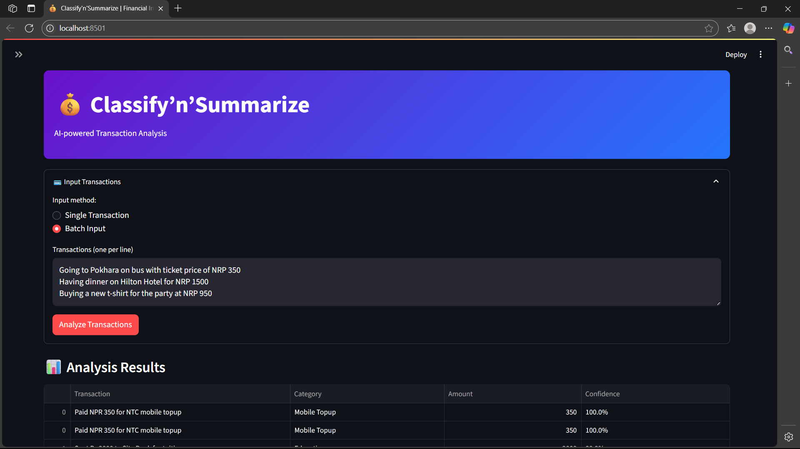
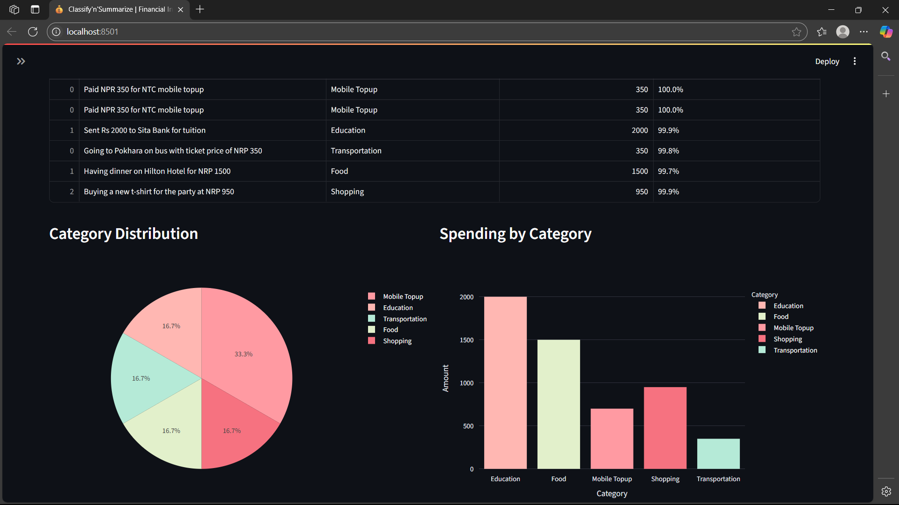
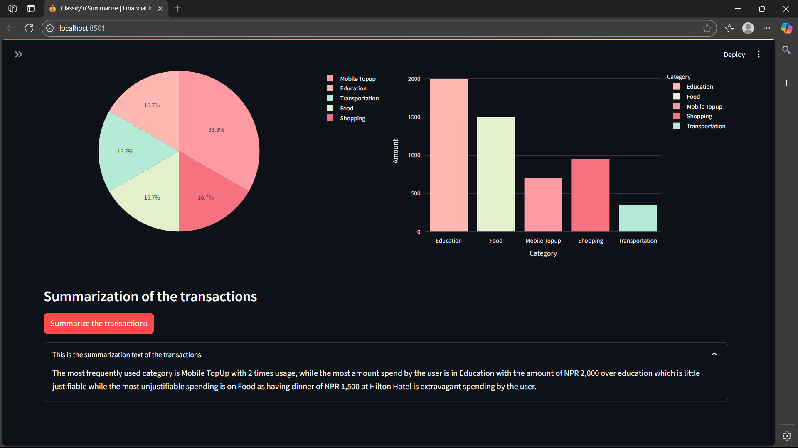

# Transaction_Categorization_and_Summarization_with_Transformer
The project, named as `Classify'n'Summarize` is to create a model which could perform the categorization and summarization of the transaction which users had done through the remarks text of the user during transactions.

---

While using the various methods were useful the execution of the code for the project has to be done through the execution of the various methods such as,

## Generating the Dataset
```bash
python data-generation/generate-dataset.py
```
which will create a `CSV` file named as _financial_transactions.csv_ which will be useful for training the **RoBERTa** transformer with **LoRA** Fine-Tuning model.

## Training the Model
After the generation of the dataset there should be the training of the model for the proper classification and later summarization of the user transactions.
```bash
python model-training/train.py
```
This will train the classification model for the classification of the transactions, while after running it also saves the model into the directory of 
`trained_models/finetuned_model` where model is saved as through which the usage of classification is much faster.

- Note: Since Summarization is done by `HuggingFace` model of _Google_ of **Flan-T5** model.

After this the dashboard could be used for visualization, while `Streamlit` was used for the demo of the models running initially.

## Dashboard Running
```bash
streamlit run app/dashboard.py
```

This will execute the dashboard, the initial testing dashboard as later the `FastAPI` and proper dashboard will be used.

---

## Execution and Testing Model

After running the `Streamlit` dashboard we get a webpage link for the simple testing dashboard where we can have the input section of single or batch inputs.



After clicking on the `Analyze Transactions` button the provided text of remarks gets classified with the confidence the model thinks.



While after the classification and simple charts of the transactions details are provided we can have the summarization of the provided data information which we can be obtained in a paragraph.



While the model is being running correctly but there still some improvements needed to be made and also the creation of the API through `FastAPI` for any device usage and also creation of modern and 
visually pleasing dashboard.

---

# Created by Summarizers Group

### Members

- [Praagya Parajuli](https://github.com/praagyap)
- [Rajendra Khanal](https://github.com/Rajendrakhanal)
- [Rohan Thapa](https://github.com/Rohan-Thapa)
